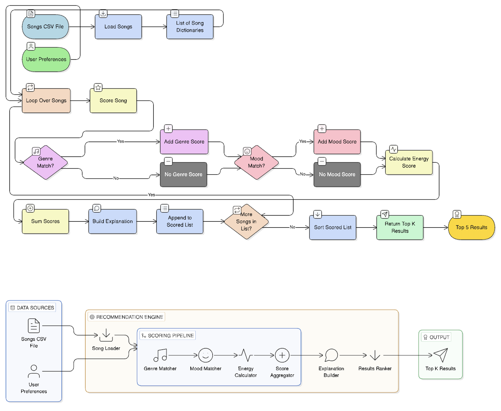
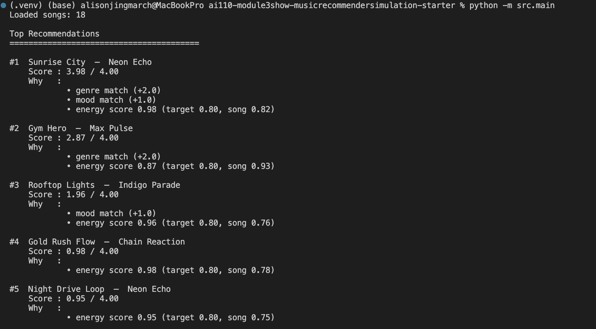
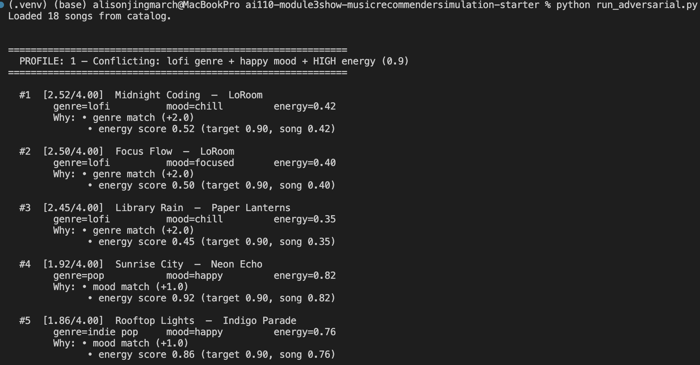
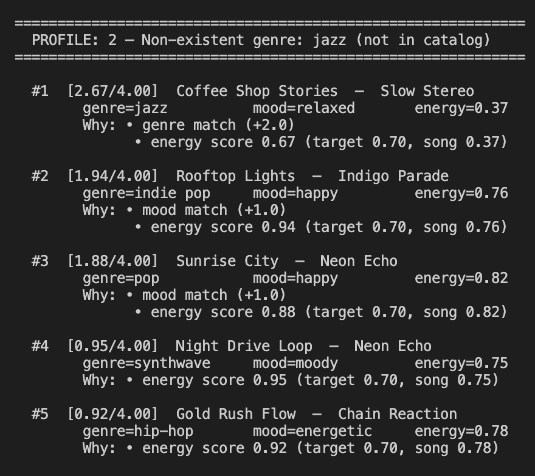
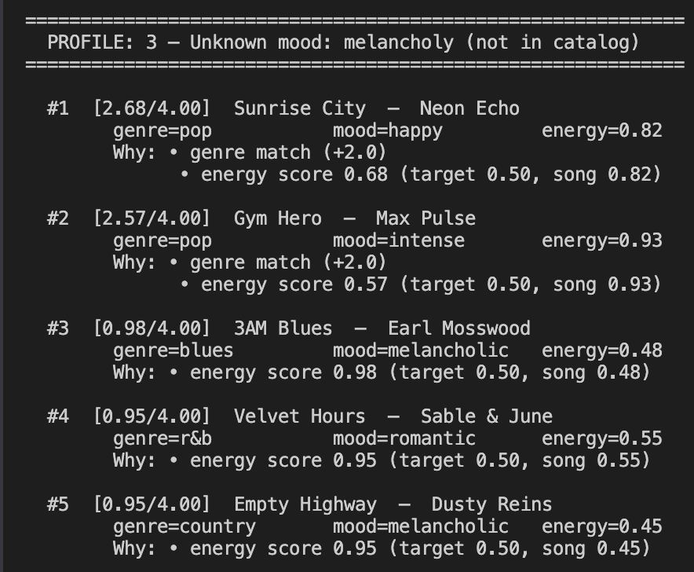
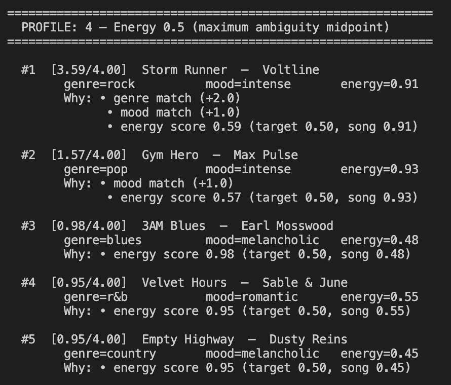
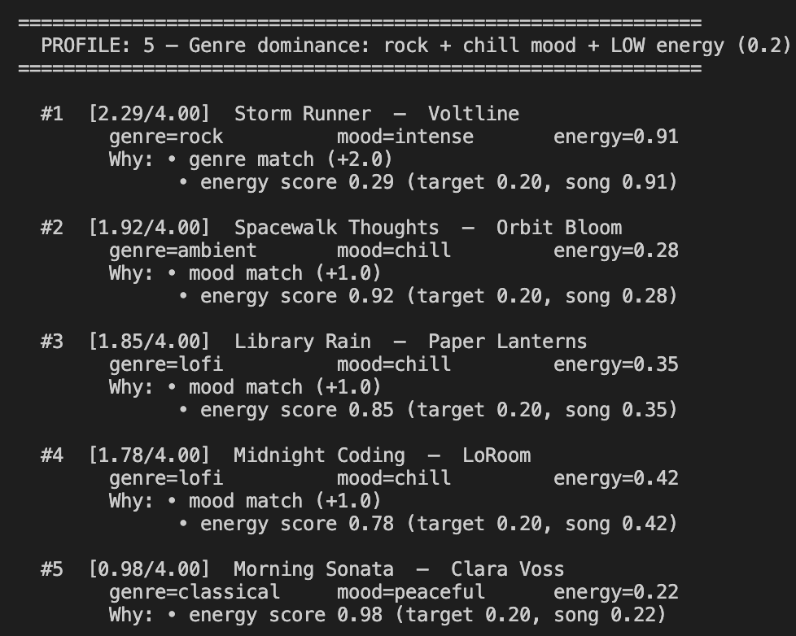
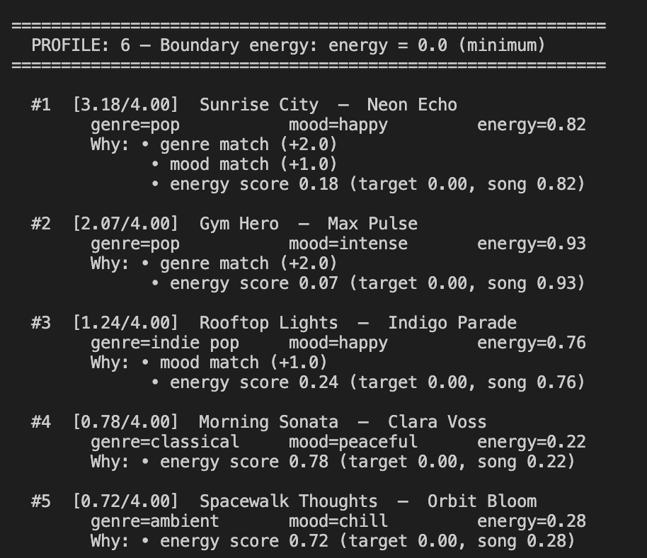

# 🎵 Music Recommender Simulation

## Project Summary

In this project you will build and explain a small music recommender system.

Your goal is to:

- Represent songs and a user "taste profile" as data
- Design a scoring rule that turns that data into recommendations
- Evaluate what your system gets right and wrong
- Reflect on how this mirrors real world AI recommenders

Replace this paragraph with your own summary of what your version does.


---

## How The System Works

### My Understanding of Real-World Recommendations and What My Version Prioritizes

Real-world recommendation systems like Spotify's Discover Weekly or YouTube's
suggested videos are hybrid engines that combine two approaches: collaborative
filtering, which surfaces content based on the behavior of users with similar
taste profiles, and content-based filtering, which compares the intrinsic
attributes of items such as tempo, energy, genre to a user's stated or inferred
preferences. At scale, these systems layer on NLP-mined cultural signals, neural
audio embeddings, and real-time behavioral feedback like skips and saves to
continuously refine what "relevant" means for each individual listener. The
result is a system that can simultaneously make safe, familiar recommendations
and genuinely surprising cross-genre discoveries.

My version operates on a much smaller, transparent scale and deliberately
prioritizes **explainability over surprise**. Rather than learning patterns
from user behavior across thousands of listeners, it scores each song directly
against a user profile using a set of interpretable rules: genre and mood
matching for categorical fit, and Gaussian distance scoring on continuous
features like energy, valence, and acousticness to reward proximity over raw
magnitude. This means every recommendation can be traced back to a specific
reason why "this song matched your energy target and mood preference", which
makes the system easier to reason about, debug, and extend. The tradeoff is
intentional: without behavioral data, the system cannot discover songs a user
would not think to ask for, but it reliably surfaces songs that fit the vibe
a user is actively seeking.

### Song Features

Each `Song` carries these attributes used for scoring:

| Feature | Type | Role |
|---|---|---|
| `genre` | string | Categorical match against user preference |
| `mood` | string | Categorical match against user preference |
| `energy` | float (0–1) | Continuous proximity to user's target energy |
| `valence` | float (0–1) | Emotional positivity — not scored directly, available for extension |
| `danceability` | float (0–1) | Rhythm suitability — available for extension |
| `acousticness` | float (0–1) | Organic vs. electronic texture — available for extension |
| `tempo_bpm` | float | Raw BPM — available for extension after normalization |

### User Profile

A `UserProfile` stores three preference fields used by the scoring rules:

- `favorite_genre` — the genre the user wants prioritized
- `favorite_mood` — the mood label the user is seeking
- `target_energy` — a float (0–1) representing how intense or calm the user wants songs to feel

### Scoring Recipe

Every song in the catalog is judged by the same three rules. Scores are raw points, not percentages:

```
score = genre_score + mood_score + energy_score

  genre_score   = 2.0  if song.genre == user.favorite_genre  else 0.0
  mood_score    = 1.0  if song.mood  == user.favorite_mood   else 0.0
  energy_score  = 1.0 - abs(song.energy - user.target_energy)

  Max possible  = 4.0
```

Genre carries the most weight (2.0) because it is the strongest single signal of listening intent. Mood adds refinement within a genre. Energy similarity provides a continuous score — a song 0.02 away from the target scores nearly as well as a perfect match, while a song 0.50 away is meaningfully penalized.

### Data Flow

```
songs.csv (18 rows)
    │
    ▼
load_songs()          cast all numeric fields to float
    │
    ▼
for song in songs:    score every song against the UserProfile
    │  _score_song()  → genre + mood + energy points
    │  _build_explanation() → human-readable reason string
    ▼
scored list           18 (song, score, explanation) tuples
    │
    ▼
sort descending       highest score first
    │
    ▼
return top k          default k = 5 recommendations
```

---

## System Diagram



---

## Sample Output

Top 5 recommendations for the default `pop / happy / 0.8` user profile:



---

## Stress Test with Diverse Profiles

## Adversarial / Edge Case Profile Results

These profiles were designed to expose unexpected or incorrect behavior in the scoring logic. Each one targets a specific weakness.

---

### Profile 1 — Conflicting: lofi genre + happy mood + high energy (0.9)

**Intent:** The user wants upbeat, high-energy music — but chose `lofi` as their genre.
**Finding:** Genre weight (2.0) dominates. All top 3 results are quiet lofi/chill songs (energy 0.35–0.42). The best actual match (`Sunrise City`, pop/happy/0.82) falls to #4.



---

### Profile 2 — Non-existent genre: `jazz` (not in catalog)

**Intent:** Tests what happens when the user's preferred genre has no match in the catalog.
**Finding:** One jazz song exists (`Coffee Shop Stories`), so it wins at #1 — but it has the wrong mood and energy. Positions #4–#5 score below 1.0 with no genre or mood points at all.



---

### Profile 3 — Unknown mood: `melancholy` (not in catalog)

**Intent:** Tests what happens when the user's preferred mood string matches no song in the catalog.
**Finding:** Mood score is permanently 0 for every song — no warning is raised. Top results are pop songs that happen to match genre, regardless of vibe. The spiritually closest song (`3AM Blues`) only reaches #3 via energy proximity.



---

### Profile 4 — Energy 0.5 (maximum ambiguity midpoint)

**Intent:** Tests whether `target_energy: 0.5` has any discriminating power.
**Finding:** The top result wins decisively via genre+mood. Positions #3–#5 are a near-tie (0.95–0.98) across unrelated genres — blues, r&b, country — purely from energy proximity. The midpoint makes energy nearly useless as a tiebreaker.



---

### Profile 5 — Genre dominance: rock + chill mood + low energy (0.2)

**Intent:** Tests whether a wrong-vibe genre match can outrank a near-perfect non-genre match.
**Finding:** `Storm Runner` (rock/intense/energy 0.91) ranks #1 at 2.29 — mismatching on both mood and energy. `Spacewalk Thoughts` (ambient/chill/energy 0.28), which almost perfectly fits the desired vibe, is pushed to #2 at 1.92.



---

### Profile 6 — Boundary energy: energy = 0.0 (minimum)

**Intent:** Tests behavior when a user requests the absolute calmest possible music.
**Finding:** `Sunrise City` (pop/happy/energy 0.82) ranks #1 at 3.18 because genre+mood points (3.0) overwhelm the terrible energy score (0.18). A user requesting silence-adjacent music receives one of the catalog's most energetic songs as the top pick.



---

## Getting Started

### Setup

1. Create a virtual environment (optional but recommended):

   ```bash
   python -m venv .venv
   source .venv/bin/activate      # Mac or Linux
   .venv\Scripts\activate         # Windows

2. Install dependencies

```bash
pip install -r requirements.txt
```

3. Run the app:

```bash
python -m src.main
```

### Running Tests

Run the starter tests with:

```bash
pytest
```

You can add more tests in `tests/test_recommender.py`.

---

## Experiments You Tried

Use this section to document the experiments you ran. For example:

- What happened when you changed the weight on genre from 2.0 to 0.5
- What happened when you added tempo or valence to the score
- How did your system behave for different types of users

---

## Limitations and Risks

Summarize some limitations of your recommender.

Examples:

- It only works on a tiny catalog
- It does not understand lyrics or language
- It might over favor one genre or mood

You will go deeper on this in your model card.

---

## Reflection

Read and complete `model_card.md`:

[**Model Card**](model_card.md)

Building this recommender made it clear that turning data into predictions is really a series of design choices disguised as math. Every feature in a song genre, mood, energy only matters as much as the weight assigned to it. The scoring formula does not "understand" music; it converts attributes into numbers and adds them up. What makes a recommendation feel right or wrong is not the algorithm itself but the decisions baked into it: which features to include, how much each one counts, and what to do when a feature is missing or unrecognized. When genre carried twice the weight of everything else combined, the system confidently returned an intense rock song to a user who asked for something calm and quiet not because the code was broken, but because the weights said genre mattered more than vibe. Real systems like Spotify or YouTube face the same fundamental problem at a much larger scale: they are still adding weighted signals, just with millions of behavioral data points and neural embeddings filling in where explicit rules fall short.

The bias and fairness risks in this kind of system are harder to see precisely because the output looks personalized and reasonable. The clearest failure here was what could be called the "single-song genre trap": because most genres in the catalog had only one representative song, any user who preferred a niche genre was guaranteed that one song as their top result regardless of mood or energy. Specificity of taste was punished rather than rewarded. A second, subtler problem was silent failure when a user typed a mood label that did not exist in the catalog, the system produced no warning and simply ignored the mood signal entirely, returning results as if mood had never been requested. In a real product, these patterns can accumulate into systemic unfairness: users whose tastes are underrepresented in the training data consistently receive worse recommendations, and they are never told why. The model does not know it is failing them. It just keeps returning the best match it can find within a catalog that was never built with their preferences in mind.


---

## 7. `model_card_template.md`

Combines reflection and model card framing from the Module 3 guidance. :contentReference[oaicite:2]{index=2}  

```markdown
# 🎧 Model Card - Music Recommender Simulation

## 1. Model Name

Give your recommender a name, for example:

> VibeFinder 1.0

---

## 2. Intended Use

- What is this system trying to do
- Who is it for

Example:

> This model suggests 3 to 5 songs from a small catalog based on a user's preferred genre, mood, and energy level. It is for classroom exploration only, not for real users.

---

## 3. How It Works (Short Explanation)

Describe your scoring logic in plain language.

- What features of each song does it consider
- What information about the user does it use
- How does it turn those into a number

Try to avoid code in this section, treat it like an explanation to a non programmer.

---

## 4. Data

Describe your dataset.

- How many songs are in `data/songs.csv`
- Did you add or remove any songs
- What kinds of genres or moods are represented
- Whose taste does this data mostly reflect

---

## 5. Strengths

Where does your recommender work well

You can think about:
- Situations where the top results "felt right"
- Particular user profiles it served well
- Simplicity or transparency benefits

---

## 6. Limitations and Bias

Where does your recommender struggle

Some prompts:
- Does it ignore some genres or moods
- Does it treat all users as if they have the same taste shape
- Is it biased toward high energy or one genre by default
- How could this be unfair if used in a real product

---

## 7. Evaluation

How did you check your system

Examples:
- You tried multiple user profiles and wrote down whether the results matched your expectations
- You compared your simulation to what a real app like Spotify or YouTube tends to recommend
- You wrote tests for your scoring logic

You do not need a numeric metric, but if you used one, explain what it measures.


A few things stand out with mood disabled:

High-Energy Pop — Gym Hero and Sunrise City lead correctly on genre+energy. But Storm Runner (rock/intense) and Iron Curtain (metal/angry) appear at #3–#5 purely on energy proximity — no mood check means aggressive metal ranks alongside upbeat pop.

Chill Lofi — Top 3 are all lofi, which feels right. But Porch Light (folk/nostalgic) and Spacewalk Thoughts (ambient/chill) creep into #4–#5 over mood-matched lofi songs, again purely on energy.

Deep Intense Rock — Storm Runner correctly leads. However positions #2–#5 are a mix of pop, hip-hop, and indie pop with no rock or intense mood — they're there only because their energy is near 0.85.

Late-Night Synthwave — Night Drive Loop leads well. But 3AM Blues, Empty Highway, and Velvet Hours fill the rest — none are synthwave or moody, just mid-energy songs. Without mood, the "late-night" atmosphere is completely lost.

Bottom line: With mood disabled, the system becomes a pure genre+energy matcher. It works when those two signals are strong, but loses all vibe/atmosphere filtering — especially visible in Synthwave and Rock where mood was doing meaningful work to separate "intense rock" from "any high-energy song."

---

## 8. Future Work

If you had more time, how would you improve this recommender

Examples:

- Add support for multiple users and "group vibe" recommendations
- Balance diversity of songs instead of always picking the closest match
- Use more features, like tempo ranges or lyric themes

---

## 9. Personal Reflection

A few sentences about what you learned:

- What surprised you about how your system behaved
- How did building this change how you think about real music recommenders
- Where do you think human judgment still matters, even if the model seems "smart"

